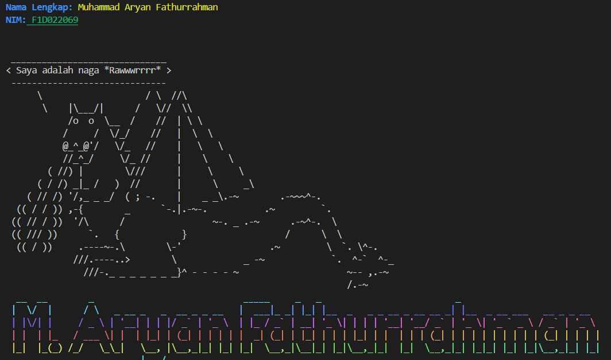

# Tugas Minggu 4: Node.js Plugins (Chalk, Cowsay, Figlet)
Proyek ini adalah sebuah skrip Node.js sederhana untuk menampilkan output terminal yang digayakan. Proyek ini menggunakan beberapa package populer seperti `chalk` untuk pewarnaan, `cowsay` untuk menampilkan karakter ASCII, `figlet` untuk membuat teks ASCII art, dan `gradient-string` untuk efek warna gradien.   

## 1. Steps to Install Dependencies (Cara Instalasi)
Pastikan kamu sudah memiliki Node.js dan npm yang terinstall di komputermu. Visual Studio Code akan secara otomatis mendeteksi instalasi tersebut.

Jika belum menginstall Node.js dan NPM maka ikutilah langkah-langkah berikut ini:
### a. Instalasi Node.js dan NPM
Jika kamu belum menginstall Node.js, ikuti langkah-langkah berikut:
- Unduh Node.js: Kunjungi situs resmi Node.js di nodejs.org.
- Pilih Versi LTS: Unduh versi LTS (Long Term Support), karena ini adalah versi yang paling stabil.
- Install: Jalankan installer yang sudah diunduh dan ikuti semua petunjuk instalasinya (cukup klik "Next" sampai selesai). NPM sudah termasuk di dalam paket instalasi Node.js.
- Verifikasi Instalasi: Buka terminal di Visual Studio Code (Terminal > New Terminal) dan jalankan perintah berikut untuk memastikan Node.js dan npm sudah terinstall dengan benar:
* node -v
* npm -v
- Jika kedua perintah tersebut menampilkan nomor versi, berarti instalasi berhasil.

### b. Instalasi Dependencies Proyek
Setelah Node.js siap, install semua package yang dibutuhkan oleh proyek ini:
- clone atau Unduh Proyek: Pastikan semua file proyek (indexCow.js, package.json, dll.) sudah ada di dalam satu folder.
- Buka Terminal: Buka terminal di dalam folder proyek tersebut.
- Jalankan Perintah Install: Ketik perintah berikut lalu tekan Enter.
* npm install
- Perintah ini akan membaca file package.json dan mengunduh semua package yang terdaftar di dalamnya.

## 2. Steps to Run the Project (Cara Menjalankan Proyek)
Proyek ini memiliki tiga skrip berbeda yang bisa dijalankan. Gunakan perintah berikut di terminal Visual Studio Code:
### a. Untuk menampilkan karakter Sapi:
* node indexCow.js
### b. Untuk menampilkan karakter Naga:
* node indexDragon.js
### c. Untuk menampilkan karakter Ghostbusters:
* node indexGhostBusters.js

## 3. Screenshot of the Output (Screenshot Hasil Output)
### a. Berikut adalah contoh hasil output dari salah satu skrip (indexCow.js):

### b. Berikut adalah contoh hasil output dari salah satu skrip (indexDragon.js);

### c. Berikut adalah contoh hasil output dari salah satu skrip (indexGhostBusters.js);
